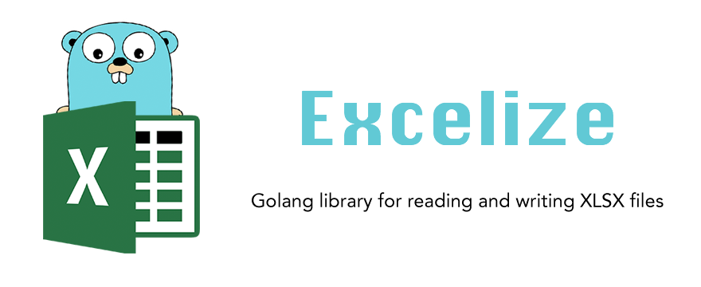

# Excelize

[](https://travis-ci.org/xuri/excelize)
[](https://codecov.io/gh/xuri/excelize)
[](https://goreportcard.com/report/github.com/xuri/excelize)
[](https://godoc.org/github.com/xuri/excelize)
[](https://opensource.org/licenses/BSD-3-Clause)
[](https://www.paypal.me/xuri)

## Introduction

Excelize is a library written in pure Golang and providing a set of functions that allow you to write to and read from XLSX files. Support reads and writes XLSX file generated by Microsoft Excel™ 2007 and later. Support save file without losing original charts of XLSX. This library needs Go version 1.8 or later. The full API docs can be seen using go's built-in documentation tool, or online at [godoc.org](https://godoc.org/github.com/xuri/excelize).

## Basic Usage

### Installation

```go
go get github.com/xuri/excelize
```

### Create XLSX file

Here is a minimal example usage that will create XLSX file.

```go
package main

import (
    "fmt"
    "os"

    "github.com/xuri/excelize"
)

func main() {
    xlsx := excelize.NewFile()
    // Create a new sheet.
    xlsx.NewSheet(2, "Sheet2")
    // Set value of a cell.
    xlsx.SetCellValue("Sheet2", "A2", "Hello world.")
    xlsx.SetCellValue("Sheet1", "B2", 100)
    // Set active sheet of the workbook.
    xlsx.SetActiveSheet(2)
    // Save xlsx file by the given path.
    err := xlsx.SaveAs("./Workbook.xlsx")
    if err != nil {
        fmt.Println(err)
        os.Exit(1)
    }
}
```

### Reading XLSX file

The following constitutes the bare to read a XLSX document.

```go
package main

import (
    "fmt"
    "os"
    "strconv"

    "github.com/xuri/excelize"
)

func main() {
    xlsx, err := excelize.OpenFile("./Workbook.xlsx")
    if err != nil {
        fmt.Println(err)
        os.Exit(1)
    }
    // Get value from cell by given sheet index and axis.
    cell := xlsx.GetCellValue("Sheet1", "B2")
    fmt.Println(cell)
    // Get sheet index.
    index := xlsx.GetSheetIndex("Sheet2")
    // Get all the rows in a sheet.
    rows := xlsx.GetRows("sheet" + strconv.Itoa(index))
    for _, row := range rows {
        for _, colCell := range row {
            fmt.Print(colCell, "\t")
        }
        fmt.Println()
    }
}
```

### Add chart to XLSX file

With Excelize chart generation and management is as easy as a few lines of code. You can build charts based off data in your worksheet or generate charts without any data in your sheet at all.


```go
package main

import (
	"fmt"
	"os"

	"github.com/xuri/excelize"
)

func main() {
	categories := map[string]string{"A2": "Small", "A3": "Normal", "A4": "Large", "B1": "Apple", "C1": "Orange", "D1": "Pear"}
	values := map[string]int{"B2": 2, "C2": 3, "D2": 3, "B3": 5, "C3": 2, "D3": 4, "B4": 6, "C4": 7, "D4": 8}
	xlsx := excelize.NewFile()
	for k, v := range categories {
		xlsx.SetCellValue("Sheet1", k, v)
	}
	for k, v := range values {
		xlsx.SetCellValue("Sheet1", k, v)
	}
	xlsx.AddChart("Sheet1", "E1", `{"type":"bar3D","series":[{"name":"=Sheet1!$A$2","categories":"=Sheet1!$B$1:$D$1","values":"=Sheet1!$B$2:$D$2"},{"name":"=Sheet1!$A$3","categories":"=Sheet1!$B$1:$D$1","values":"=Sheet1!$B$3:$D$3"},{"name":"=Sheet1!$A$4","categories":"=Sheet1!$B$1:$D$1","values":"=Sheet1!$B$4:$D$4"}],"title":{"name":"Fruit 3D Line Chart"}}`)
	// Save xlsx file by the given path.
	err := xlsx.SaveAs("./Workbook.xlsx")
	if err != nil {
		fmt.Println(err)
		os.Exit(1)
	}
}
```

### Add picture to XLSX file

```go
package main

import (
    "fmt"
    "os"
    _ "image/gif"
    _ "image/jpeg"
    _ "image/png"

    "github.com/xuri/excelize"
)

func main() {
    xlsx, err := excelize.OpenFile("./Workbook.xlsx")
    if err != nil {
        fmt.Println(err)
        os.Exit(1)
    }
    // Insert a picture.
    err = xlsx.AddPicture("Sheet1", "A2", "./image1.png", "")
    if err != nil {
        fmt.Println(err)
    }
    // Insert a picture to sheet with scaling.
    err = xlsx.AddPicture("Sheet1", "D2", "./image2.jpg", `{"x_scale": 0.5, "y_scale": 0.5}`)
    if err != nil {
        fmt.Println(err)
    }
    // Insert a picture offset in the cell with printing support.
    err = xlsx.AddPicture("Sheet1", "H2", "./image3.gif", `{"x_offset": 15, "y_offset": 10, "print_obj": true, "lock_aspect_ratio": false, "locked": false}`)
    if err != nil {
        fmt.Println(err)
    }
    // Save the xlsx file with the origin path.
    err = xlsx.Save()
    if err != nil {
        fmt.Println(err)
        os.Exit(1)
    }
}
```

## Contributing

Contributions are welcome! Open a pull request to fix a bug, or open an issue to discuss a new feature or change.

## Credits

Some struct of XML originally by [tealeg/xlsx](https://github.com/tealeg/xlsx).

## Licenses

This program is under the terms of the BSD 3-Clause License. See [https://opensource.org/licenses/BSD-3-Clause](https://opensource.org/licenses/BSD-3-Clause).
